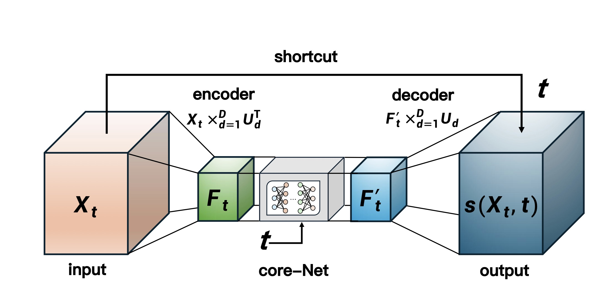

# Tucker-Unet
Here provides the codes to reproduce the numerical experiments in the paper "Tucker Diffusion Model for High-dimensional Tensor Generation".

<p align="center">
  
</p>

## 📝 Summary

A Tucker diffusion model is proposed for learning high-dimensional tensor distributions. Indeed, the score function admits a structured decomposition under the low Tucker rank assumption, allowing it to be both accurately approximated and efficiently estimated using a carefully tailored tensor-shaped architecture named Tucker-Unet. 

## Citation

```
@article{guo2026tucker,
  title={Tucker Diffusion Model for High-dimensional Tensor Generation},
  author={Guo, Jianhua and Kong, Xinbing and Li, Zeyu and Mao, Junfan},
  journal={arXiv preprint arXiv:2604.00481},
  year={2026}
}
```
